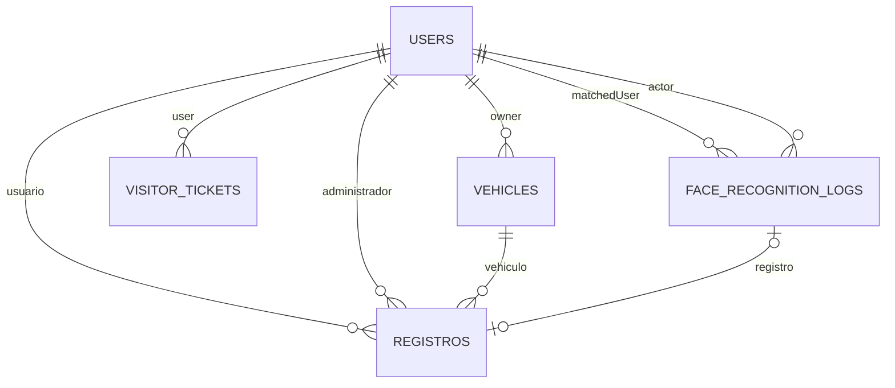

# Modelo de datos

## Relaciones

## `users`

Modelo: `backend/src/models/user.model.js`.

Campos principales:

- Identidad: `cedula`, `nombre`, `apellido`, `email`, `telefono`, `RH`.
- Clasificacion: `facultad`, `rolAcademico`, `permisoSistema`.
- Estado: `activo`, `inactivo` o `bloqueado`.
- Media: `imagen`, `imagenQR`.
- Biometria: `faceDescriptor`, `faceRegistered`, `faceDescriptorUpdatedAt`.
- Documento: `documentIdentity.photo`, datos OCR y consentimiento.
- Timestamps: `created_at`, `updated_at`.

`faceDescriptor` no se selecciona por defecto. El password se almacena hasheado pero debe excluirse explicitamente en respuestas.

Indices:

- Email unico por Mongoose.
- Cedula unica y sparse.
- `(permisoSistema, estado)`.
- `faceRegistered`, `rolAcademico`, `facultad`, `created_at`.

## `registros`

Modelo: `backend/src/models/entry-exit.model.js`.

- Referencias: `usuario`, `administrador`, `vehiculo`, `faceRecognitionLog`.
- Entrada: `fechaEntrada`, `horaEntrada`.
- Salida: `fechaSalida`, `horaSalida`, `duracionSesion`.
- Metodo: `manual`, `qr` o `face`.
- Cierre: `cierreForzado`, `cierreMotivo`, `observaciones`.
- Alertas: estado, elevacion, resolucion y notas.

Una sesion esta abierta cuando `fechaSalida` es nula o no existe.

Indices:

- `(usuario, fechaEntrada desc)`.
- `fechaEntrada desc`.
- `(fechaSalida, fechaEntrada desc)`.
- `(alertStatus, fechaEntrada desc)`.

## `vehicles`

Modelo: `backend/src/models/vehicle.model.js`.

Contiene propietario, tipo, marca, modelo, color, placa, imagen, notas y estado. Existe para asociacion con registros, pero actualmente no hay CRUD HTTP `/api/vehicles`.

## `visitor_tickets`

Modelo: `backend/src/models/visitor-ticket.model.js`.

- `user`: visitante propietario.
- `token`: valor unico.
- `expiresAt`: expiracion con indice TTL `expireAfterSeconds: 0`.

MongoDB elimina el ticket despues de expirar. Por ello, esta coleccion no es un historial confiable de tickets antiguos. Una necesidad de auditoria historica requiere una coleccion de eventos separada o retirar el TTL del registro historico.

## `face_recognition_logs`

Modelo: `backend/src/models/face-recognition-log.model.js`.

- Actor que realizo el escaneo.
- Usuario reconocido, si existe.
- Estado `matched`, `unmatched` o `error`.
- `score`, `threshold`, calidad de deteccion y perfiles comparados.
- Mensaje de error y referencia opcional al registro.

Indices por fecha, estado, usuario reconocido, actor y registro.

## Colecciones de evaluacion

- `face_evaluation_runs`
- `face_evaluation_profiles`
- `face_evaluation_probes`
- `face_evaluation_score_chunks`

Estas colecciones pertenecen al harness robusto, se identifican por `runId` y no forman parte del flujo productivo de acceso.

## Ciclos de vida

### Usuario normal

Creacion -> enrolamiento/QR opcional -> activacion por acceso -> salida/inactividad -> bloqueo o eliminacion administrativa.

### Visitante

Registro -> ticket activo -> acceso -> vencimiento del ticket. El frontend intenta llamar `/visitors/expire`, que marca inactivo y cierra una sesion abierta; si solo actua TTL, el documento se elimina sin esas mutaciones. Luego puede existir reactivacion administrativa.

### Biometria

Captura -> embedding -> almacenamiento en `users` -> comparacion -> log de reconocimiento -> referencia opcional desde `registros`.

## Retencion recomendada

La aplicacion no implementa una politica automatica para usuarios, registros, documentos, embeddings o logs faciales. El despliegue debe definir plazos, respaldo, eliminacion y respuesta a solicitudes de titulares antes de usar datos reales.
