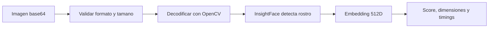

# Arquitectura del servicio facial

## Responsabilidad

El face-service transforma una imagen en un embedding facial. No autentica usuarios, no persiste perfiles, no calcula coincidencias y no decide accesos.

## API vigente

| Metodo | Ruta | Funcion |
|---|---|---|
| GET | `/health` | Estado, entorno y modelo cargado. |
| POST | `/extract-embedding` | Valida imagen, detecta rostro y devuelve embedding. |
| GET | `/docs` | Swagger generado por FastAPI. |
| GET | `/redoc` | ReDoc generado por FastAPI. |

No existen rutas FastAPI `/enroll` ni `/identify`. Esas operaciones pertenecen al backend Express.

## Pipeline



Etapas temporizadas:

- `base64_decode_ms`
- `image_decode_validation_ms`
- `face_analysis_ms`
- `total_ms`

El backend agrega `node_face_service_round_trip_ms` al recibir la respuesta.

## Contrato

Solicitud:

```json
{
  "image": "data:image/jpeg;base64,/9j/4AAQ..."
}
```

Respuesta:

```json
{
  "success": true,
  "embedding": [0.0123, -0.0456],
  "detection_score": 0.98,
  "embedding_dimensions": 512,
  "timings": {
    "base64_decode_ms": 1.2,
    "image_decode_validation_ms": 4.5,
    "face_analysis_ms": 86.3,
    "total_ms": 92.7
  },
  "message": "Embedding facial extraido correctamente."
}
```

El ejemplo acorta `embedding`; la respuesta real contiene 512 numeros.

## Modelo

- InsightFace `buffalo_l`.
- ONNX Runtime sobre CPU en la configuracion actual.
- Ventana de deteccion predeterminada: 640 x 640.
- Resolucion minima: 200 x 200.
- Tamano maximo predeterminado: 5 MB decodificados.

## Carga y salud

El lifespan de FastAPI carga el modelo antes de servir solicitudes. `health.model_loaded` permite comprobar disponibilidad. El primer inicio puede descargar el modelo en `FACE_MODEL_ROOT`.

## Errores

FastAPI devuelve errores de validacion y procesamiento en `detail`. El backend los traduce a su formato y usa:

- `503` cuando no puede conectar.
- `504` cuando vence el timeout.
- El status original cuando FastAPI responde con error HTTP.

## Rendimiento

- Las solicitudes son sincronas y ejecutan inferencia en el proceso web.
- No hay batching ni cola.
- Varias replicas deben compartir la misma version de modelo, no necesariamente el cache.
- Mida `face_analysis_ms` y round-trip antes de cambiar el timeout.

## Seguridad

Despliegue el servicio en red privada. Las imagenes y embeddings son datos biometricos; no deben registrarse completos ni enviarse a servicios de terceros sin base legal y consentimiento.
