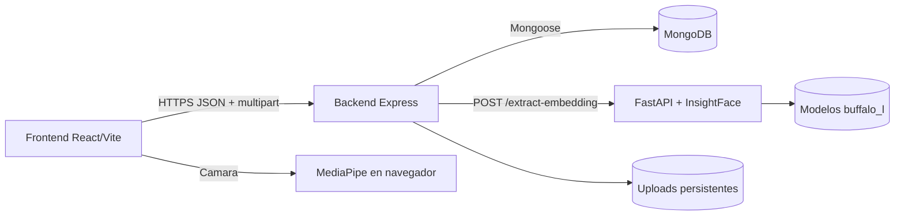
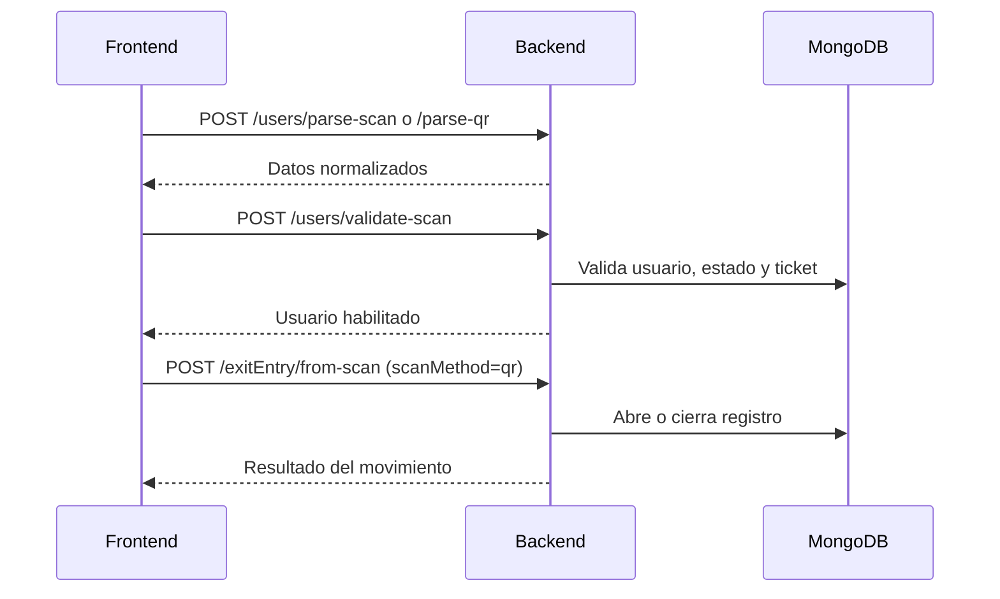

# Vision general del sistema

## Proposito

La plataforma registra y supervisa accesos universitarios mediante tres metodos: registro manual, codigo QR y reconocimiento facial. Centraliza identidad, sesiones de entrada/salida, visitantes, alertas y analitica.

## Contenedores



### Frontend

- SPA React 18 construida con Vite.
- Maneja navegacion, captura de camara, formularios, QR, notificaciones y exportaciones.
- Conserva sesion en `localStorage` y valida el perfil al restaurarla.
- No accede directamente a MongoDB ni al face-service.

### Backend

- API REST Express montada bajo `/api`.
- Unica capa autorizada para persistencia, matching facial y reglas de negocio.
- Almacena archivos en disco y publica `/uploads`.
- Compara embeddings con similitud coseno y genera auditoria facial.

### Face-service

- Microservicio FastAPI interno.
- Decodifica y valida una imagen base64.
- Detecta un rostro con InsightFace y devuelve un embedding de 512 dimensiones.
- No decide identidades ni persiste perfiles.

### MongoDB

- Fuente de verdad para usuarios, registros, tickets y logs.
- Los tickets usan TTL; los registros de acceso y logs faciales no tienen expiracion automatica.

## Flujo de una identificacion facial

```mermaid
sequenceDiagram
    actor Operator as Administrador/Celador
    participant Web as Frontend
    participant API as Backend
    participant Face as Face-service
    participant DB as MongoDB

    Operator->>Web: Captura rostro
    Web->>API: POST /api/face/identify
    API->>Face: POST /extract-embedding
    Face-->>API: embedding[512], detection_score, timings
    API->>DB: Consulta perfiles enrolados
    API->>API: Similitud coseno y mejor candidato
    API->>DB: Guarda FaceRecognitionLog
    API-->>Web: match, usuario, score, threshold, logId
    Web->>API: POST /api/exitEntry/from-scan
    API->>DB: Crea entrada o cierra salida; al crear entrada puede vincular el log
    API-->>Web: Movimiento confirmado
```

## Flujo QR



## Principios actuales

- El backend es la frontera de seguridad y reglas de negocio.
- El face-service solo extrae caracteristicas biometricas.
- Una sesion abierta es un registro sin `fechaSalida`.
- El frontend envia `direction=entry|exit`; si se omite, el backend infiere la accion desde `user.estado`, no desde el registro abierto.
- Un usuario `bloqueado` no puede autenticarse ni usar endpoints protegidos.
- Los datos de analitica de accesos se agregan en MongoDB, sin paginar registros individuales.

## Limites y dependencias externas

- MediaPipe y recursos asociados pueden descargarse desde CDN en el navegador.
- InsightFace puede descargar modelos durante el primer arranque.
- Uploads en disco requieren volumen persistente en produccion.
- No existe una cola de trabajos; OCR y extraccion facial son solicitudes sincronas.
- No hay router publico de vehiculos ni integracion Arduino implementada.
