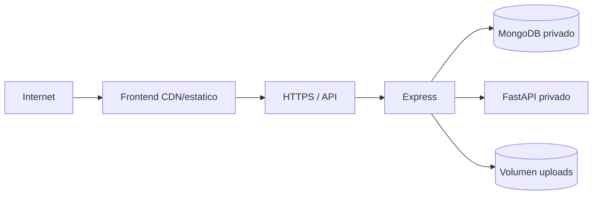

# Despliegue

## Topologia recomendada



Exponga solo frontend y backend. Mantenga MongoDB y face-service en red privada.

## Frontend

1. Configure `VITE_API_URL=https://api.ejemplo.edu/api` antes del build.
2. Ejecute `npm ci && npm run build`.
3. Publique `frontend/dist`.
4. Configure fallback SPA a `index.html`. `frontend/vercel.json` contiene rewrite para Vercel.

## Backend

1. Instale dependencias con `npm ci --omit=dev`.
2. Defina variables y secretos.
3. Monte volumen persistente en `UPLOAD_DIR`.
4. Ejecute `npm start`.
5. Configure proxy con body limit superior a 5 MB y timeout compatible con OCR/facial.

El backend no tiene endpoint `/health`; use una ruta autenticada apropiada o agregue un health check dedicado antes de automatizar balanceadores. `/ruta-prueba` solo confirma Express, no MongoDB ni face-service.

## Face-service

1. Cree entorno Python e instale `requirements.txt`.
2. Precargue `buffalo_l` o permita descarga en primer inicio.
3. Monte cache de modelos si desea evitar descargas tras recrear el contenedor.
4. Ejecute Uvicorn/Gunicorn con host y puerto explicitos.
5. Compruebe `/health` y `model_loaded`.

Ejemplo:

```bash
python -m uvicorn main:app --host 0.0.0.0 --port 8000
```

## MongoDB

- Restrinja red y use credenciales de minimo privilegio.
- Habilite backups y pruebe restauracion.
- Verifique creacion de indices Mongoose.
- Considere que TTL borra tickets y no se restaura como historial operativo.

## CORS

```dotenv
CORS_ALLOWED_ORIGINS=https://app.ejemplo.edu,https://admin.ejemplo.edu
```

No use `*` con datos reales. El frontend debe apuntar al dominio API correcto.

## Almacenamiento

Los paths de usuario apuntan a `/uploads/...`. Si el backend es efimero y no monta volumen, las referencias quedaran rotas al redesplegar. Para multiples replicas use almacenamiento compartido o migre a objeto/S3 y adapte `resolveAssetUrl`.

## Verificacion posterior

1. Face `/health` devuelve modelo cargado.
2. Backend conecta MongoDB sin errores.
3. Login administrativo funciona.
4. Upload devuelve path accesible.
5. Enrolamiento e identificacion funcionan.
6. Entrada/salida crea y cierra registro.
7. Estadisticas reflejan el movimiento.
8. Excel y PDF se descargan.

## Rollback

- Mantenga artefacto anterior del frontend/API/face-service.
- Los cambios de esquema actuales son aditivos, pero confirme indices antes de rollback.
- No revierta una base con comandos destructivos; restaure backup validado si una migracion lo requiere.
