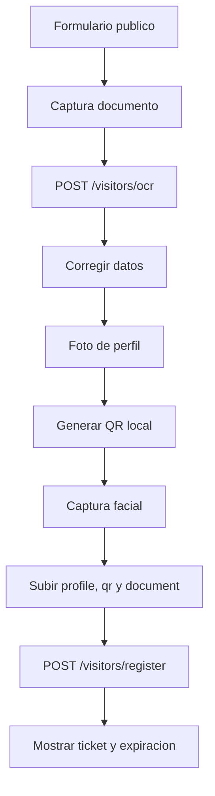

# Flujo de visitantes

## Registro publico

Ruta: `/register-visitor`. Tambien puede abrirse como modal desde el escaner.

## OCR

OCR usa Tesseract (`spa+eng`) y propone cedula, nombres, apellidos y fecha de nacimiento. El visitante debe verificar los datos; OCR no reemplaza validacion humana.

## Archivos

Se cargan por separado:

- Foto de perfil.
- QR generado en navegador.
- Documento de identidad.

Los paths retornados se incluyen en el registro final.

## Rostro

El formulario envia `faceImage` a `POST /visitors/register`. Como el registro es publico, el backend delega internamente la extraccion al face-service y almacena el descriptor con el visitante. Si el servicio facial no esta disponible, la visita puede crearse con una advertencia y el rostro se enrola posteriormente desde el directorio.

## Ticket

Al registrar:

- Crea un usuario con `rolAcademico=Visitante` y `permisoSistema=Usuario`; email o cedula existente produce `409`.
- Genera token aleatorio.
- Define `expiresAt` segun `VISITOR_TICKET_TTL_MINUTES`.
- MongoDB elimina el ticket al expirar.

El ticket es una credencial temporal, no un JWT.

## Expiracion

Al vencer, la validacion deja de aceptar el ticket y MongoDB TTL termina eliminandolo. Ese proceso natural no cambia por si solo el usuario ni sus registros.

Cuando el visitante esta autenticado, el temporizador del frontend intenta llamar `POST /visitors/expire`. Ese endpoint:

1. Vence el ticket mas reciente.
2. Marca el usuario inactivo, salvo que este bloqueado.
3. Cierra forzadamente un registro abierto.
4. Permite al frontend limpiar sesion/ticket local.

MongoDB TTL no garantiza eliminacion en el milisegundo exacto; la validacion de aplicacion tambien compara `expiresAt`.

## Reactivacion

Un Administrador o Celador puede reactivar por `userId`. Se renueva el ticket mas reciente o se crea uno, se devuelve nueva expiracion y el visitante puede autenticarse de nuevo.

## Consideraciones de datos

- El documento y OCR son datos personales.
- La foto y embedding son datos biometricos.
- La interfaz debe presentar consentimiento y finalidad.
- No use el ticket TTL como historial de visitas; los documentos expiran y se eliminan.
- Para auditoria historica, diseñe eventos inmutables independientes.
